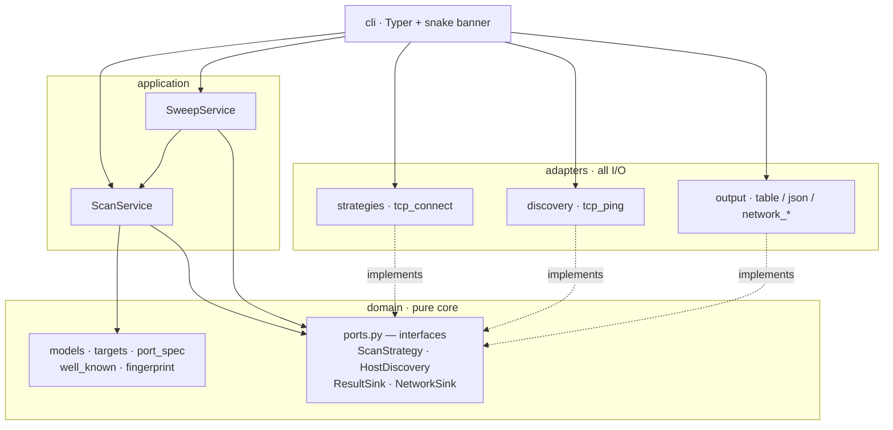
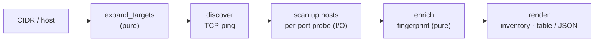

# pyscan

A tiny, modular, **hexagonal** port scanner — a mini-Nmap built to be expanded.


The point of this project isn't the scanner — a TCP connect scan is ~30 lines.
It's the **architecture**: a clean ports-and-adapters layout where every new
scan technique, output format, and discovery method is a drop-in, and the core
engine never changes.

## What works now

- **Async TCP connect scan** — unprivileged, concurrency-capped, fast
- **Banner grabbing** — reads what services volunteer on connect, plus an HTTP
  `HEAD` nudge to coax `Server:` headers out of web servers
- **Service / version detection** — a pure, regex-driven fingerprint engine
  (`OpenSSH 9.6p1`, `nginx 1.24.0`, ...)
- **Host discovery + CIDR sweep** — TCP-ping a whole range, build an inventory
  of live hosts and their services
- **Modbus/TCP identification** — read-only OT asset discovery (vendor /
  product / firmware), for **simulators only**
- **Output** — a pretty `rich` terminal table *and* machine-readable JSON
- **26 tests**, mostly pure-unit, no network required

## Quick start

```bash
pip install -e ".[dev]"     # or: make dev
pytest -q                   # 26 passing
```

```bash
# deep scan of a single host
pyscan scan scanme.nmap.org -p 22,80,443

# discover live hosts across a range and inventory them
pyscan sweep 192.168.1.0/24
pyscan sweep 192.168.1.0/24 --detail        # + per-host port tables
pyscan sweep 10.0.0.0/28 --json net.json     # machine-readable inventory

# Modbus/TCP device identification — SIMULATORS / lab gear ONLY
pyscan scan 127.0.0.1 -p 502 --type modbus

pyscan version        # the snake
pyscan strategies     # list scan techniques
```

> **Use it only on hosts you own or are authorised to test.**
> `scanme.nmap.org` exists precisely for practice. Unsolicited scanning of
> third-party networks can be illegal.

## Architecture

Dependencies point **inward**. The domain knows nothing about sockets, the
terminal, or Typer. Adapters depend on the domain's interfaces, never the
reverse — so anything on the outer ring is swappable in isolation.



The scan pipeline keeps **probing** (I/O) separate from **identifying** (pure
logic), so each stage is testable and replaceable on its own:



## Project layout

```
src/pyscan/
├── domain/            pure core — no I/O
│   ├── models.py          value objects + ScanReport / NetworkReport
│   ├── ports.py           the 4 interfaces (the hexagon boundary)
│   ├── targets.py         CIDR / IP / host expansion
│   ├── port_spec.py       "1-1024,8080" parser
│   ├── fingerprint.py     banner -> service/product/version
│   └── well_known.py      port -> service map
├── application/
│   ├── scan_service.py    single-host orchestration + enrichment
│   └── sweep_service.py   discovery + per-host scan + inventory
├── adapters/          all I/O lives here
│   ├── strategies/        tcp_connect (+ registry)
│   ├── discovery/         tcp_ping
│   └── output/            table · json · network_table · network_json
└── cli/                   main (Typer) · banner (snake)
```

## How to extend

| Want to add… | Do this | Touches the engine? |
|---|---|---|
| A scan technique (SYN, UDP) | new file in `adapters/strategies/`, `@register("name")` | no |
| An output format (CSV, SQLite) | implement `ResultSink` / `NetworkSink` | no |
| A discovery method (ICMP, ARP) | implement `HostDiscovery` | no |
| Detection for a new product | one regex row in `fingerprint.py` | no |

## Roadmap

- [x] TCP connect scan, async concurrency, table + JSON
- [x] Banner grabbing + HTTP nudge
- [x] Service / version fingerprinting
- [x] Host discovery + CIDR sweep + inventory
- [x] Modbus/TCP identification (read-only) — simulators only
- [x] IEC 60870-5-104 identification (read-only) — simulators only
- [x] S7comm identification (read-only) — simulators only
- [ ] SYN / half-open scan (raw sockets, privileged)
- [ ] SYN / half-open scan (raw sockets, privileged)
- [ ] UDP scan
- [ ] Reuse this skeleton for a packet sniffer (with a Textual TUI)

## Docker

Run it with no local Python setup:

```bash
docker build -t pyscan .
docker run --rm pyscan scan scanme.nmap.org -p 22,80,443
docker run --rm pyscan sweep 192.168.1.0/24
```

The image *is* the command (pyscan is the entrypoint). This is a CLI tool, so
it's deliberately not orchestrated — there is no long-running service to scale,
which is what Kubernetes is for.

## Notes on privileges

The `tcp-connect` scan and `tcp-ping` discovery use ordinary kernel sockets —
**no root required**. A future SYN scan crafts raw packets and *will* need
elevated rights; that's the OS gating raw sockets, not Python.

## License

MIT — see [LICENSE](LICENSE).
