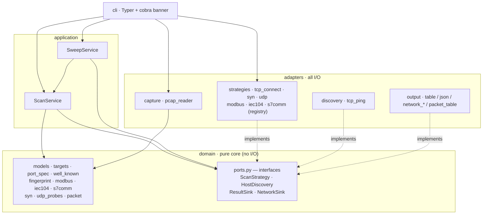
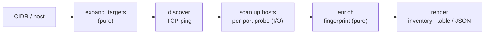

```
       .-~~~-.                  .-~~~-.
      /  _ _  \                /  _ _  \
     |  / o \  |              |  / o \  |
   __|  \   /  |              |  \   /  |__
>='   \  '-'  /                \  '-'  /   '=<
       '~. .~'                  '~. .~'
       .-' '-.                  .-' '-.
      /  ___  \                /  ___  \
     |  /   \  |              |  /   \  |
      \ \   / /                \ \   / /
       '~'-'~'                  '~'-'~'
            _ __ _  _ ___ __ __ _ _ _
           | '_ \ || (_-</ _/ _` | ' \
           | .__/\_, /__/\__\__,_|_||_|
           |_|   |__/
```

# pyscan

A modular, **hexagonal** port & OT-protocol scanner — a mini-Nmap built to be expanded.


The point of this project isn't the scanner — a TCP connect scan is ~30 lines.
It's the **architecture**: a clean ports-and-adapters layout where every new
scan technique, protocol, output format, and discovery method is a drop-in, and
the core engine never changes. Six scan techniques, five OT/app protocols, two
transport families, host discovery, and a packet sniffer all hang off the same
small hexagon.

## What works now

- **Async TCP connect scan** — unprivileged, concurrency-capped, fast
- **SYN / half-open scan** — raw packets via scapy (privileged; `pip install
  pyscan[syn]`), with a graceful fallback when run without rights
- **UDP scan** — unprivileged, with protocol-aware payloads (DNS, SNMP, NTP,
  DNP3, Modbus/UDP) so silent services actually answer
- **Banner grabbing** — reads what services volunteer on connect, plus an HTTP
  `HEAD` nudge to coax `Server:` headers out of web servers
- **Service / version detection** — a pure, regex-driven fingerprint engine
  (`OpenSSH 9.6p1`, `nginx 1.24.0`, ...)
- **Host discovery + CIDR sweep** — TCP-ping a whole range, build an inventory
  of live hosts and their services
- **OT / ICS identification** (read-only, **simulators only**):
  - **Modbus/TCP** — vendor / product / firmware via the device-ID object
  - **IEC 60870-5-104** — TESTFR liveness check
  - **S7comm** — module order-number via SZL read
- **Packet sniffer** — decode a `.pcap` into a mini-tshark table
  (Ethernet/IPv4/TCP/UDP/ICMP/ARP), filter by protocol
- **Output** — a pretty `rich` terminal table *and* machine-readable JSON
- **68 tests**, mostly pure-unit, no network required, run in CI on 3.11 & 3.12

## Quick start

```bash
pip install -e ".[dev]"     # or: make dev
pytest -q                   # 68 passing
```

```bash
# deep scan of a single host (connect scan + banners + version)
pyscan scan scanme.nmap.org -p 22,80,443
pyscan scan scanme.nmap.org --top-ports 100        # the 100 most common ports
pyscan scan scanme.nmap.org -p 1-1024 --csv out.csv # also export CSV

# other scan techniques
pyscan scan scanme.nmap.org -p 22,80,443 --type syn      # half-open (needs root/Npcap)
pyscan scan 8.8.8.8        -p 53,123     --type udp --all # UDP w/ OT-aware probes

# discover live hosts across a range and inventory them
pyscan sweep 192.168.1.0/24
pyscan sweep 192.168.1.0/24 --detail         # + per-host port tables
pyscan sweep 10.0.0.0/28 --json net.json      # machine-readable inventory

# OT / ICS device identification — SIMULATORS / lab gear ONLY
pyscan scan 127.0.0.1 -p 502   --type modbus
pyscan scan 127.0.0.1 -p 2404  --type iec104
pyscan scan 127.0.0.1 -p 102   --type s7comm

# packet sniffer — decode a capture file
pyscan sniff capture.pcap
pyscan sniff capture.pcap --proto tcp --count 50

pyscan version        # the snakes
pyscan strategies     # list scan techniques
```

> **Use it only on hosts you own or are authorised to test.**
> `scanme.nmap.org` exists precisely for practice. OT identification is
> read-only and meant for **simulators** — on live ICS gear the scan can *be*
> the incident. Unsolicited scanning of third-party networks can be illegal.

## Architecture

Dependencies point **inward**. The domain knows nothing about sockets, the
terminal, or Typer. Adapters depend on the domain's interfaces, never the
reverse — so anything on the outer ring is swappable in isolation, and a new
technique is a new file plus one `@register` line.



The pipeline keeps **probing** (I/O) separate from **identifying** (pure logic),
so each stage is testable and replaceable on its own:



## Project layout

```
src/pyscan/
├── domain/                 pure core — no I/O, fully unit-tested
│   ├── models.py               value objects + ScanReport / NetworkReport
│   ├── ports.py                the 4 interfaces (the hexagon boundary)
│   ├── targets.py              CIDR / IP / host expansion
│   ├── port_spec.py            "1-1024,8080" parser
│   ├── well_known.py           port -> service map
│   ├── fingerprint.py          banner -> service / product / version
│   ├── modbus · iec104 · s7comm    OT protocol codecs (read-only)
│   ├── syn.py                  SYN response -> PortState (pure)
│   ├── udp_probes.py           protocol-aware UDP payloads
│   └── packet.py               Ethernet/IPv4/TCP/UDP/ICMP decoders
├── application/
│   ├── scan_service.py         single-host orchestration + enrichment
│   └── sweep_service.py        discovery + per-host scan + inventory
├── adapters/               all I/O lives here
│   ├── strategies/             tcp_connect · syn · udp · modbus · iec104 · s7comm (+ registry)
│   ├── discovery/              tcp_ping
│   ├── capture/                pcap_reader
│   └── output/                 table · json · network_table · network_json · packet_table
└── cli/                        main (Typer) · banner (cobras)
```

## How to extend

| Want to add… | Do this | Touches the engine? |
|---|---|---|
| A scan technique (e.g. FIN, Xmas) | new file in `adapters/strategies/`, `@register("name")` | no |
| A new protocol probe | pure codec in `domain/`, thin strategy in `adapters/strategies/` | no |
| An output format (CSV, SQLite) | implement `ResultSink` / `NetworkSink` | no |
| A discovery method (ICMP, ARP) | implement `HostDiscovery` | no |
| Detection for a new product | one regex row in `fingerprint.py` | no |

## Roadmap

- [x] TCP connect scan, async concurrency, table + JSON
- [x] Banner grabbing + HTTP nudge
- [x] Service / version fingerprinting
- [x] Host discovery + CIDR sweep + inventory
- [x] Modbus/TCP identification (read-only) — simulators only
- [x] IEC 60870-5-104 identification (read-only) — simulators only
- [x] S7comm identification (read-only) — simulators only
- [x] SYN / half-open scan (raw sockets, privileged — `pip install pyscan[syn]`)
- [x] UDP scan (unprivileged, OT-aware probes: DNS/SNMP/NTP/DNP3/Modbus)
- [x] CI (GitHub Actions: pytest + ruff on 3.11 / 3.12)
- [x] Packet sniffer — pcap decode + mini-tshark table
- [x] Polish: `--top-ports`, CSV export
- [ ] Packet sniffer — live capture + Textual TUI

## Docker

Run it with no local Python setup:

```bash
docker build -t pyscan .
docker run --rm pyscan scan scanme.nmap.org -p 22,80,443
docker run --rm pyscan sweep 192.168.1.0/24
```

The image *is* the command (pyscan is the entrypoint). This is a CLI tool, so
it's deliberately not orchestrated — there is no long-running service to scale,
which is what Kubernetes is for.

## Notes on privileges

`tcp-connect`, `udp`, `tcp-ping` discovery, and reading a `.pcap` all use
ordinary kernel sockets / file I/O — **no root required**. The `syn` scan crafts
raw packets and *does* need elevated rights (Linux: `sudo`; Windows: admin +
Npcap; or run it from WSL2) — that's the OS gating raw sockets, not Python.
pyscan prints a clear hint instead of a traceback when run without them.

## License

MIT — see [LICENSE](LICENSE).
